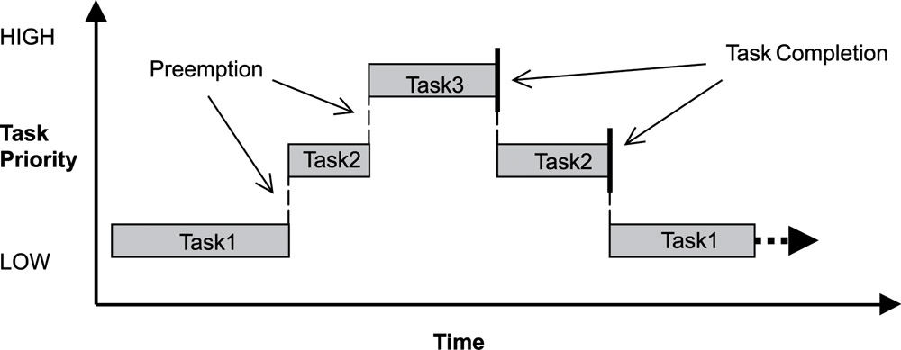

= Sample "RTOS" - Use of RS 232 serial interface for C's printf & Co.
:Author:    Peter Vranken 
:Email:     mailto:Peter_Vranken@Yahoo.de
:toc:       left
:numbered:

== About this sample

This sample implements an easy to reuse RTOS for the NXP MPC5643L. The
sample started as a copy of sample "printf". The RTOS implementation has
been added (new folder `code\RTOS`) and the main module `code\mai_main.c`
has been modified in order to make use of the RTOS; the functionality is
similar to sample "startup" with its blinked LEDs. Several tasks are
running concurrently and the LEDs are driven by different tasks. Some
progress information is printed to the serial output but much of the
operation can be observed only in the debugger.

The startup code in folder `code\startup` is the same as for the other
samples, the RTOS makes use of the infrastructure it offers.

To see how the sample works you need to open a terminal software on your
host machine. You can find a terminal as part of the CodeWarrior Eclipse
IDE; go to the menu, "Window/Show View/Other/Terminal/Terminal".

Open the serial port, which is offered by the TRK-USB-MPC5643L. (On
Windows, open the Computer Management and go to the Device Manager to find
out.) The Baud rate has been selected as 115200 Bd in file
`code\mai_main.c`, 8 Bit, no parity, 1 start and stop Bit. The terminal
should print the messages, which are regularly sent by the sample code
running on the evaluation board.

Try to press button SW3 on the evaluation board and see what happens.

== The RTOS

The proposed RTOS is little exciting with respect to its functionality.
The scheduler implements the Basic Conformance Class (BCC) 1 of the
OSEK/VDX standard and BCC 2 with the exception of activation queuing.

The scheduler offers an API to register periodic tasks and event tasks. It
has an API to activate event tasks by software, from interrupt service
routines (ISR) or other tasks. All scheduling is strictly priority
controlled. 

ISRs are installed and used as in the other tasks, this is done with the
infrastructure offered by the startup code.

For mutual exclusion of tasks and/or ISRs, if shared data is involved, a
lock API is offered that implements the priority ceiling protocol (PCP).
The already known mechanisms from the startup code can however still be
used. It permits to globally lock and resume all interrupts.

The use of the RTOS is further supported by some less essential diagnostic
functions. They offer stack usage information, task overrun information
and averaged CPU load information.

What's much more exciting than functionality is the code size of the RTOS.
The complete kernel (RTOS initialization with task registering and
start of scheduler, the scheduler and the PCP implementation) requires no
more than 209 lines of C code.
  footnote:[Counted with https://github.com/AlDanial/cloc[cloc] in
revision c9fb69f4ed4af39434fc53d485cce6210fcd14e5 of this project.]
  All code has been counted, which was written for the RTOS in addition to
the anyway needed startup code from the other samples.

With this number of lines of code our RTOS is likely one of the shortest
32 Bit RTOSs far and wide! This barely believable conciseness of code has
a single explanation: The MPC5643L actually implements the OSEK/VDX BCC
standard by hardware and the required C code is no more than a thin
wrapper layer around the hardware in order to make the hardware
functionality available to the C-coded application software. This
explanation is at the same time the reason, why an extension of the RTOS'
functionality is not possible by nature: An implementation of e.g. the
Extended Conformance Classes (ECC) of the OSEK/VDX standard would mean a
complete software implementation of an according kernel.

=== The kernel operation

Like for an OSEK/VDX BCC1 system, a task is started (activated), executed
and eventually terminated. The activation can be done periodically or
event triggered. The event can be sent by another task or an ISR. A task
can however not prematurely suspend and doesn't know blocking states in
which it waits for some event.

The preemption of tasks is purely priority controlled. A task of higher
priority, that is activated will immediately be executed (i.e. it becomes
running) and the task running so far is preempted. This task enters state
"ready". Toggling between the states "running" and "ready" is all what can
happen with the tasks as long as they are alive. This leads to a simple
hierarchical structure of possible preemptions, see figure
<<figSchemeOfPreemptions>>.
  footnote:[The picture has been downloaded at
http://www.embeddedlinux.org.cn/rtconforembsys/5107final/images/other-0405_0.jpg
on Nov 19, 2017.]
  
[[figSchemeOfPreemptions]]
.Task preemption in a BCC kernel

The hierarchical preemption scheme permits having a single data stack. The
information to push onto the stack in order to implement a context switch
from one task to another task is just the same as in any simple, RTOS free
system, which makes use of interrupts. This explains, why the RTOS can be
implemented as an extension of the anyway required startup code and why it
doesn't require any assembler code.

Although BCC means a significant reduction of complexity and functionality
in comparison to a full featured real time kernel, the embedded practice
mostly doesn't require more than this. The typical data flow paradigm is
to have event triggered tasks, which serve the asynchronous I/O channels
and strictly cyclic application tasks, which process the data and
implement the control strategies. The communication between ISRs and tasks
is done either by queues or by overwriting (last recent value supersedes
earlier ones), that depents. It's a simple model, which has the advantage
of being well understood, transparent and by nature free of dead locks.
The latency times are higher than for consequently designed event
controlled systems but they are predictable and have easy to determine
upper bounds. Last but not least, software design can determine the upper
bounds by choosing appropriate cycle times.

==== Tasks and interrupts

TODOC:

- ihw_installINTCInterruptHandler() applied to define ISRs
- preemptable or not
- same priorities, prio range, prio 15 non preemptable, no scheduler
- task before ISR at same prio level
- task may have higher prio than ISR, unlike OSEK/VDX
- task effectively is an ISR
- use/availablity of software interrupts to the application code
- availablity of PID timers to the application code

=== Book E versus VLE

The RTOS implementation is not specific to one of the instruction sets.
The sample uses the Book E environment but `mai_main.c` and the RTOS
itself can be compiled and run with the VLE startup code, too.
  footnote:[As of writing, Nov 2017, this has not been proven yet.]

== Tools

=== Environment

==== Command line based build

The makefiles and related scripts require a few settings of the
environment in the host machine. In particular, the location of the GNU
compiler installation needs to be known and the PATH variable needs to
contain the paths to the required tools. 

For Windows users there is a shortcut to PowerShell in the root of this
project (not sample), which opens the shell with the prepared environment.
Furthermore, it creates an alias to the appropriate GNU make executable.
You can simply type `make` from any location to run MinGW32 GNU make.

The PowerShell process reads the script `setEnv.ps1`, located in the
project root, too, to configure the environment. This script requires
configuration prior to its first use. Windows users open it in a text
editor and follow the given instructions that are marked by TODO tags.
Mainly, it's about specifying the installation directory of GCC.

Non-Windows users will read this script to see, which (few) environmental
settings are needed to successfully run the build and prepare an according
script for their native shell.

==== Eclipse for building, flashing and debugging

Flashing and debugging is always done using the NXP CodeWarrior Eclipse
IDE, which is available for free download. If you are going to run the
application build from Eclipse, too, then the same environmental settings
as decribed above for a shell based build need to be done for Eclipse. The
easiest way to do so is starting Eclipse from a shell, that has executed
the script `setEnv.ps1` prior to opening Eclipse.

For Windows users the script `CW-IDE.ps1` has been prepared. This script
requires configuration prior to its first use. Windows users open it in a
text editor and follow the given instructions that are marked by TODO
tags. Mainly, it's about specifying the installation directory of
CodeWarrior.

Non-Windows users will read this script to see, which (few) environmental
and path settings are needed to successfully run the build under control
of Eclipse and prepare an according script for their native shell.

Once everything is prepared, the CodeWarrior Eclipse IDE will never be
started other than by clicking the script `CW-IDE.ps1` or its equivalent
on non-Windows hosts.

See https://github.com/PeterVranken/TRK-USB-MPC5643L[project overview] and
https://github.com/PeterVranken/TRK-USB-MPC5643L/wiki/Tools-and-Installation[GitHub
Wiki] for more details about downloading and installing the required
tools.

=== Compiler and makefile

Compilation and linkage are makefile controlled. The compiler is GCC
(MinGW-powerpc-eabivle-4.9.4). The makefile is made generic and can be
reused for other projects, not only for a tiny "Hello World" with a few
source files. It supports a number of options (targets); get an overview
by typing:
 
    cd <projectRoot>/LSM/RTOS
    mingw32-make help

The main makefile `GNUmakefile` has been configured for the build of
sample "RTOS". Type:

    mingw32-make -s build 
    mingw32-make -s build CONFIG=PRODUCTION

to produce the flashable files (`bin\ppc\DEBUG\TRK-USB-MPC5643L-RTOS.elf`
and `bin\ppc\PRODUCTION\TRK-USB-MPC5643L-RTOS.elf`).

NOTE: The makefile requires the MinGW port of the make processor. The Cygwin
port will fail with obscure, misleading error messages. It's safe to use
the `make.exe` from the compiler installation archive. The makefile is
designed to run on different host systems but has been tested with Windows
7 only.

=== Flashing and debugging

The sample code can be flashed and debugged with the CodeWarrior IDE.

To flash the `*.elf` file, open the CodeWarrior IDE, go to the menu, click
"Window/Show View/Other/Debug/Debugger Shell". In the debugger shell
window, type:

    cd <rootFolderOfSample>/makefile/debugger
    source flashDEBUG.tcl
    
or

    source flashPRODUCTION.tcl

The debugger is started by a click on the black triangle next to the blue
icon "bug", then click "Debug Configurations.../CodeWarrior/Debug RTOS
(DEBUG)". Confirm and start the debugger with a last click on button
"Debug".

You can find more details on using the CodeWarrior IDE at
https://github.com/PeterVranken/TRK-USB-MPC5643L/wiki/Tools-and-Installation.

== Code architecture

This sample builds on the basic sample "startup" located in a sibling folder. 
"printf" is compiled for the Book E instruction set. All build settings
and the software architecture are identical to "startup". Please refer to
https://github.com/PeterVranken/TRK-USB-MPC5643L/blob/master/LSM/startup/readMe.adoc
for details.

== Known issues

Debugger: If the view shows the INTC0 register set then the debugger
harmfully affects program execution and the RTOS fails: The write to
INTC_EOIR_PRC0, which normally restores the current priority level
INTC_CPR_PRC0, now fails to do so. The complete interrupt handling fails
from now on. Mostly the effect is that the OS tick interrupt, which has a
high priority, leaves this high priority level set in the INTC_CPR_PRC0,
so that effectively no interrupts (including itself) are handled any more.
Only the code of the idle task is executed any longer.

This effect can be observed with other samples, too. It had not been found
before as observing the current priority level from the debugger had been
done intensively only when putting the RTOS code to operation.

Workaround: Don't open the view of the INTC0 in the debugger when
debugging an RTOS application. Then the INTC and the code work fine.