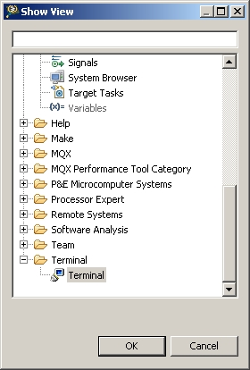
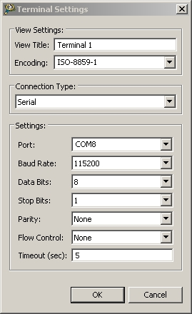

= Sample "RTuinOS" - A proof of concept of kernelBuilder
:Author:    Peter Vranken 
:Email:     mailto:Peter_Vranken@Yahoo.de
:toc:       left
:toclevels: 3
:xrefstyle: short
:numbered:

== About this sample

This sample is a proof of concept for package
https://github.com/PeterVranken/TRK-USB-MPC5643L/tree/master/LSM/kernelBuilder[kernelBuilder].
RTuinOS, the event controlled real time operating system for Arduino, has
been migrated for the e200z4 core and all original RTuinOS samples run on
the TRK-USB-MPC5643L evaluation board. RTuinOS makes use of kernel
interrupts, which can cause task switches, and of system calls for
suspending tasks or for sending events to resume others.

RTuinOS consists of the source code folder `code\RTOS` (kernelBuilder is
contained). To make it run on the evaluation board, the known folder
`code\startup` was added. All samples use console output and they share
the implementation of the serial interface in folder `code\serial`. Folder
`code\common` contains the C entry point `main()`, which is designed such
that the application code gets an environment similar to the original
Arduino board.

The folders in folder `code\applications` contain a sample application of
RTuinOS each. Besides demonstrating the use of RTuinOS, they are
considered test cases for the kernel -- which explains the name `tc<n>`.

The build and debug scripts are a bit different to what you know from the
other TRK-USB-MPC5643L samples. They take an argument to select an
application to compile; RTuinOS itself is an infra-structure only, it is
not a self-contained, flashable executable, you always need to compile it
together with some client code.

To see how the sample works you need to open a terminal software on your
host machine. You can find a terminal as part of the CodeWarrior Eclipse
IDE; go to the menu, "Window/Show View/Other/Terminal/Terminal" (see
<<figOpenTerminalView>>).

[[figOpenTerminalView]]
.Code Warrior Eclipse -- How to open the terminal window

Open the serial port, which is offered by the TRK-USB-MPC5643L. (Mostly,
it is the last one offered in the drop down box of the terminal settings.
Otherwise, on Windows, open the Computer Management and go to the Device
Manager to find out.) The Baud rate has been selected as 115200 Bd in file
`code\common\mai_main.c`, 8 Bit, no parity, 1 start and stop Bit (see
<<figTerminalSettings>>). The sequence \r\n is used as end of line
character. The terminal should print the messages, which are regularly
sent by the sample code running on the evaluation board.

[[figTerminalSettings]]
[.text-center]
.Code How to configure the terminal

=== Book E versus VLE

The implementation of RTuinOS is not specific to one of the instruction
sets. The build scripts and the Eclipse configuration support both
instruction sets.

The makefile takes an additional switch on the command line, state
`INSTR=BOOK_E` (default) or `INSTR=VLE` to build the software in the
wanted instruction set.

In the Eclipse project, all build and debug configurations have been
duplicated, once for each instruction set. The TCL scripts, which can be
used in CodeWarrior's debugger shell window to flash the software, have
got another argument to select the instruction set, too.

== RTuinOS

RTuinOS as such is not in the focus of this project. It's an Arduino
project and you can refer to its
https://sourceforge.net/projects/rtuinos/[original location]. The
documentation is distributed as
https://github.com/PeterVranken/TRK-USB-MPC5643L/tree/master/LSM/RTuinOS/doc/manual/RTuinOS-1.0-UserGuide.pdf[PDF manual].

The manual has not been edited with respect to differences due to e200z4
and board migration. To a small extend, the source code documentation of
the sample applications highlights the made changes but most of the
documentation has not been reworked so that you will still find remarks
about Arduino specifics. It is not planned to edit the manual or to rework
the code documentation in the future.

=== Simplified configuration

Effectively, the implementation of RTuinOS became simpler. The original
Arduino implementation contains a lot of preprocessor code to make the
type of some principal data objects configurable. This aimed at using as
short types as possible to be as close to the native processor type (8
Bit) as possible. For the 32 Bit e200z4 core this is useless and we have
removed all of this configuration stuff.

=== Modified interface for kernel interrupts

The principle of how to let interrupts interfere with the kernel has not
been changed but the interface with the client code has changed a bit.
Acknowledging an interrupt at the source device can not longer be done in
a generic way and in the e200z4 port the client code needs to provide
according code. See configuration macro RTOS_ISR_USER_00_ACKNOWLEDGE_IRQ
for details.

=== Additional, new interface for kernel interrupts

An alternative, more general, more transparent interface to install
interrupts that interfere with the kernel has been added. The
functionality is basically the same: A kernel interrupt can send an event
to the tasks. Instead of doing this behind the curtain, the explicit, new
API `rtos_sc_sendEvent()` is offered for kernel relevant interrupt
handlers. Explicit sending of events from an ISR permits sending any set
of events of any kind (broadcasted, mutex or semaphore) to the tasks
instead of a single broadcasted event as it used to be in the Arduino
implementation.

The new way to deal with interrupts is demonstrated in sample application
tc14. The ADC driver known from the other TRK-USB-MPC5643L sample
https://github.com/PeterVranken/TRK-USB-MPC5643L/tree/master/LSM/ADC[ADC]
has been integrated and slightly modified; a few lines of code changes
make its on-conversion-callback become an RTuinOS kernel interrupt, which
can control task activations synchronously with the ADC conversion cycle.
(The ADC cycle has been chosen asynchronous with the RTOS system clock for
didactic reasons.)

The new interface to interrupts requires a new callback from the startup
procedure of RTuinOS: The client code must enable the interrupt source
only after initialization of the RTuinOS kernel (the first released
interrupt could otherwise send an event, which couldn't be safely
processed yet) but the original Arduino/RTuinOS initialization callback,
`setup()`, is invoked prior (and preparatory) to the kernel
initialization. Although induced by the new interrupt interface the new
callbacks are in no way specific to or restricted to this use case. See
next section for details.

=== Additional, new initialization callbacks from kernel into client code

The two major callbacks, `void startup(void)` and `void loop(void)` are
already known from Arduino and RTuinOS for Arduino. The only change in the
e200z4 port is the default implementation for callback `loop()`. If the
client code doesn't provide an implementation then the default
implementation is used, which does nothing. Note, there's no default
implementation for `startup()`; not having any task initialization code is
not considered a supported use case.

Two new callbacks, `void setupAfterKernelInit(void)` and `void
setupAfterSystemTimerInit(void)`, are offered in the e200z4 port.

`void setupAfterKernelInit(void)` is called after kernel initialization.
All tasks are created but they are still in suspended state. The operating
system clock has not yet been started. The callbacks `void
rtos_enableIRQUser00(void)` and `void rtos_enableIRQUser01(void)` from the
elder kernel interrupt interface, which contain the client code to enable
the application interrupts, have not been called yet. Consequently, there
are still no race conditions; no kernel interrupt is possible, which could
make a task ready can appear during execution of this callback. However,
the kernel is already in the state to process such interrupts and
therefore this callback is the optimal code location for releasing the
kernel interrupts, which are implemented with the new kernel interrupt
interface. Such interrupts may appear still during or immediately after
return from this callback and they will be properly handled.

Note, this implies that task code can be executed before you return from
this function. The statement made about a race condition free environment
doesn't hold any longer once your callback code has released the first
kernel interrupt!

`void setupAfterSystemTimerInit(void)` is called later, after having
started the operating system clock and after invocation of the callbacks
`void rtos_enableIRQUser00(void)` and `void rtos_enableIRQUser01(void)`.
All interrupts are running and task scheduling takes place. The call of
this function occurs prior to the first call of `loop()` and the context
is exactly the same as for the calls of `loop()`. The call of
`setupAfterSystemTimerInit` is virtually the same as the very first call
of `loop()` used to be. The use case for this callback is the
initialization of the operations done later in `loop()`. Furthermore,
there's no obligation to return from this function if the idle task should
be organized other than in an infinite loop. Not returning from this
callback means to omit `loop()` entirely.

The use of both new callbacks, `void setupAfterKernelInit(void)` and `void
setupAfterSystemTimerInit(void)`, is optional. There is a default
implementation for each of them, which does nothing otherwise.

== Tools

=== Environment

==== Command line based build

The makefiles and related scripts require a few settings of the
environment in the host machine. In particular, the location of the GNU
compiler installation needs to be known and the PATH variable needs to
contain the paths to the required tools. 

For Windows users there is a shortcut to PowerShell in the root of this
project (not sample), which opens the shell with the prepared environment.
Furthermore, it creates an alias to the appropriate GNU make executable.
You can simply type `make` from any location to run MinGW32 GNU make.

The PowerShell process reads the script `setEnv.ps1`, located in the
project root, too, to configure the environment. This script requires
configuration prior to its first use. Windows users open it in a text
editor and follow the given instructions that are marked by TODO tags.
Mainly, it's about specifying the installation directory of GCC.

Non-Windows users will read this script to see, which (few) environmental
settings are needed to successfully run the build and prepare an according
script for their native shell.

==== Eclipse for building, flashing and debugging

Flashing and debugging is always done using the NXP CodeWarrior Eclipse
IDE, which is available for free download. If you are going to run the
application build from Eclipse, too, then the same environmental settings
as described above for a shell based build need to be done for Eclipse. The
easiest way to do so is starting Eclipse from a shell, that has executed
the script `setEnv.ps1` prior to opening Eclipse.

For Windows users the script `CW-IDE.ps1` has been prepared. This script
requires configuration prior to its first use. Windows users open it in a
text editor and follow the given instructions that are marked by TODO
tags. Mainly, it's about specifying the installation directory of
CodeWarrior.

Non-Windows users will read this script to see, which (few) environmental
and path settings are needed to successfully run the build under control
of Eclipse and prepare an according script for their native shell.

Once everything is prepared, the CodeWarrior Eclipse IDE will never be
started other than by clicking the script `CW-IDE.ps1` or its equivalent
on non-Windows hosts.

See https://github.com/PeterVranken/TRK-USB-MPC5643L[project overview] and
https://github.com/PeterVranken/TRK-USB-MPC5643L/wiki/Tools-and-Installation[GitHub
Wiki] for more details about downloading and installing the required
tools.

=== Compiler and makefile

Compilation and linkage are makefile controlled. The compiler is GCC
(MinGW-powerpc-eabivle-4.9.4). The makefile is made generic and can be
reused for other projects, not only for a tiny "Hello World" with a few
source files. It supports a number of options (targets); get an overview
by typing:
 
    cd <projectRoot>/LSM/RTuinOS
    mingw32-make help

The main makefile `GNUmakefile` has been configured for the build of
sample "RTuinOS" but the kernel can't be linked to a runnable binary
without an application. You need to specify the name of an RTuinOS
application on the command line of make. Set variable APP to do so.
Possible application names can be found as the name of the folders inside
`<projectRoot>/LSM/RTuinOS/code/applications'. Type ("tc01" is just an
example):

    mingw32-make -s build APP=tc01
    mingw32-make -s build APP=tc01 INSTR=BOOK_E CONFIG=PRODUCTION
    mingw32-make -s build APP=tc01 INSTR=VLE
    mingw32-make -s build APP=tc01 INSTR=VLE CONFIG=PRODUCTION

to produce the flashable files
`bin\ppc-BookE\tc01\DEBUG\TRK-USB-MPC5643L-RTuinOS-tc01.elf`,
`bin\ppc-BookE\tc01\PRODUCTION\TRK-USB-MPC5643L-RTuinOS-tc01.elf`,
`bin\ppc-VLE\tc01\DEBUG\TRK-USB-MPC5643L-RTuinOS-tc01.elf`,
and
`bin\ppc-VLE\tc01\PRODUCTION\TRK-USB-MPC5643L-RTuinOS-tc01.elf`.

To get more information, type:

    mingw32-make help

NOTE: The makefile requires the MinGW port of the make processor. The
Cygwin port will fail with obscure, misleading error messages. It's safe
to use the `make.exe` from the compiler installation archive but
explicitly typing `mingw32-make` will avoid any problem.

The makefile is designed to run on different host systems but has been
tested with Windows 7 only.

Note, the Eclipse project configuration in the root folder of this sample
supports the build of only a sub-set of the possible configurations.
RTuinOS can be compiled with a few sample applications only, each of them
in DEBUG and PRODUCTION compilation and for either instruction set. To
build the other samples with Eclipse you would have to duplicate the
existing build configurations and adapt the make command lines in the
build settings according to the explanations and examples above.

=== Flashing and debugging

The sample code can be flashed and debugged with the CodeWarrior IDE.

To flash the `*.elf` file of an RTuinOS application like `tc01`, open the
CodeWarrior IDE, go to the menu, click "Window/Show
View/Other/Debug/Debugger Shell". In the debugger shell window, type for
example:

    cd <rootFolderOfSample>/makefile/debugger
    set APP tc01
    set INSTR VLE
    source flashDEBUG.tcl
    
or

    set APP tc01
    set INSTR BOOK_E
    source flashPRODUCTION.tcl

(Setting TCL variables APP and INSTR doesn't need to be repeated prior to
every repeated flashing.)

The debugger is started by a click on the black triangle next to the blue
icon "bug", then click "Debug Configurations.../CodeWarrior/RTuinOS (tc01,
Book E, DEBUG)". Confirm and start the debugger with a last click on
button "Debug".

(Or select the according debug configuration for another RTuinOS application.)

You can find more details on using the CodeWarrior IDE at
https://github.com/PeterVranken/TRK-USB-MPC5643L/wiki/Tools-and-Installation.

== Code architecture

This sample builds on sample "kernelBuilder" located in a sibling folder.
"RTuinOS" can be compiled for both, the Book E and the VLE instruction
set. All build settings and the software architecture are identical to
"kernelBuilder". Please refer to
https://github.com/PeterVranken/TRK-USB-MPC5643L/blob/master/LSM/kernelBuilder/readMe.adoc[LSM/kernelBuilder/readMe.adoc]
for details.
