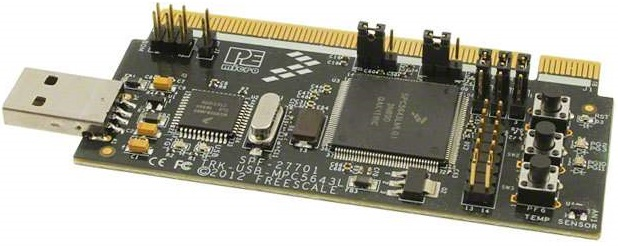

// See https://isis.apache.org/guides/dg/resources/asciidoc-writers-guide.pdf
= TRK-USB-MPC5643L -- Open Source Toolchain Support for a low-cost PowerPC Evaluation Board
:Author:    Peter Vranken
:Email:     mailto:Peter_Vranken@Yahoo.de
:Revision:  1
:toc:       right

== Introduction

This project aims at supporting the software development for the NXP PowerPC
microcontroller MPC5643L with professional yet free of charge software
development tools. It's not difficult to find a GNU C cross compiler for the
PowerPC architecture in the Internet but as a matter of experience it's
quite cumbersome to make it produce a flashable and running piece of code.
Furthermore, if we have produced such a binary file then it's still
another matter to flash it and to find and setup a debugger to step through
it.

.The NXP evaluation board TRK-USB-MPC5643L

None of these tasks can be solved in general. There are too many
dependencies on the host machine, the tool revisions, the specific chip
from the PowerPC family and the hardware board it is mounted on. Any
imaginable configuration of these will need particular investigation and
specific solutions. This project focuses on a single such configuration
and offers a clean, professional level solution for that one. It might be
possible or not possible, more or less difficult or more or less effortful
to migrate this solution to other revisions or ports of GCC or other
derivates from the microcontroller family but this is considered your
responsibility and out of scope of this project.

An important exception is the choice of the host machine. We don't expect
problems with Linux. GCC is anyway a native UNIX tool, Cygwin is obsolete
by nature, the CodeWarrior is available for Linux, too, and the makefiles
used in this project have been designed to run under Linux. Please note,
that this has not been tested yet.

The configuration for this project is:

[frame="none",options="noheader",width="100%",cols="1,2"]
|=======
|microcontroller|https://www.nxp.com/products/microcontrollers-and-processors/power-architecture-processors/mpc5xxx-55xx-32-bit-mcus/ultra-reliable-mpc56xx-32-bit-automotive-and-industrial-microcontrollers-mcus/ultra-reliable-dual-core-32-bit-mcu-for-automotive-and-industrial-applications:MPC564xL[NXP PowerPC MPC5643L]
|Evaluation board|https://www.nxp.com/support/developer-resources/hardware-development-tools/startertrak-development-boards/mpc5643l-startertrak-for-safety-applications:TRK-USB-MPC5643L[NXP TRK-USB-5643L]
|Host|Windows 7
|C compiler|https://drive.google.com/open?id=0B_3zBh2c7LroNEFIOVlJcUVKRWc[MinGW-powerpc-eabivle-4.9.4]
|Unix tools|http://www.cygwin.com/[Cygwin]
|Flash tool|https://www.nxp.com/pages/codewarrior-for-mcus-eclipse-ide-coldfire.-56800-e-dsc-kinetis.-nxp-56xx-rs08-s08-s12z-v10.7:CW-MCU10?tab=Design_Tools_Tab[NXP CodeWarrior 10.7]
|Debugger|(same as flash tool)
|=======

The project presents a number of code samples for this hardware and
toolchain configuration. All samples are intended to support your software
development. They are no fully elaborated, functional applications but
they offer high quality building blocks for a true application. The next
section gives an overview.

== The samples

The most prominent embedded sample is the blinking LED, called
https://github.com/PeterVranken/TRK-USB-MPC5643L/tree/master/LSM/startup["startup"]
in this project. While it is not of any use as such it does contain a lot
of reusable stuff for real development: As there is the toolchain setup
(compiler, linker, flash tool, debugger), a powerful, generic, fully
reusable makefile and a clean piece of startup code -- either in Book E or
VLE instruction set -- , which will suffice for most applications. Remove
the LED blink code and start writing your application but don't loose time
with setting up your development environment.

https://github.com/PeterVranken/TRK-USB-MPC5643L/tree/master/LSM/printf["printf"]
adds a serial communication interface with a terminal program running on
the host computer, that can be used with formatted output through the C
library functions `printf` and Co.

https://github.com/PeterVranken/TRK-USB-MPC5643L/tree/master/LSM/RTOS["RTOS"]
is the very lean implementation of a reusable real time operating system
offering the functionality similar to an OSEK/VDX kernel of conformance
class BCC1 or BCC2.

All samples are self-contained. There are some common elements, which are
same in all samples, like startup code and makefile. It would be natural
to put them in a shared directory and reuse them across the samples. We
decided not to do so in order to make the reuse of the samples as simple as
possible. Once you have installed the tools you will be able to copy any
sample to an arbitrary local directory and either run the makefile from
the command line or use the CodeWarrior IDE with our Eclipse project file
to build the sample. The CodeWarrior IDE is in either case required to
flash and debug the built software.

== Installation

Please, find more details on installing the required development tools
in Wiki page
https://github.com/PeterVranken/TRK-USB-MPC5643L/wiki/Tools-and-Installation[Tools
and Installation].

== Documentation

* The Wiki pages of this project tell more about download and installation
  of the tools and how to run the samples
* Each sample has a "readMe", which outlines the functionality and its
  particular added value
* The code and scripts are documented by source code comments
* Most relevant documentation about the evaluation board and the
  microcontroller has been collected in folder `doc` and much, much more
  can be found in the Internet
